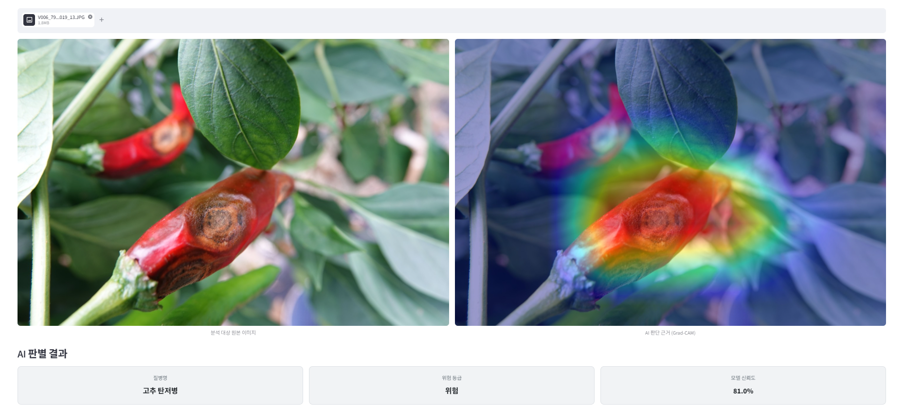
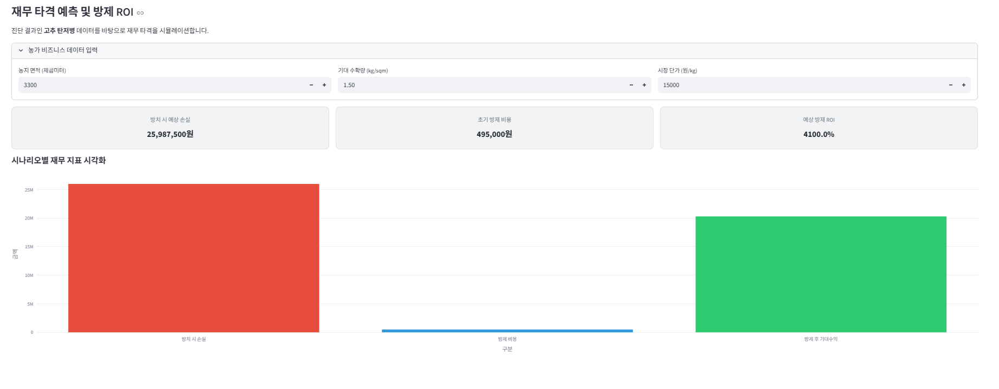
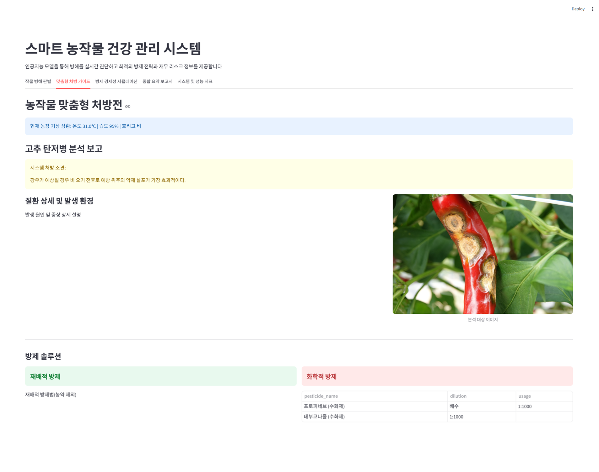
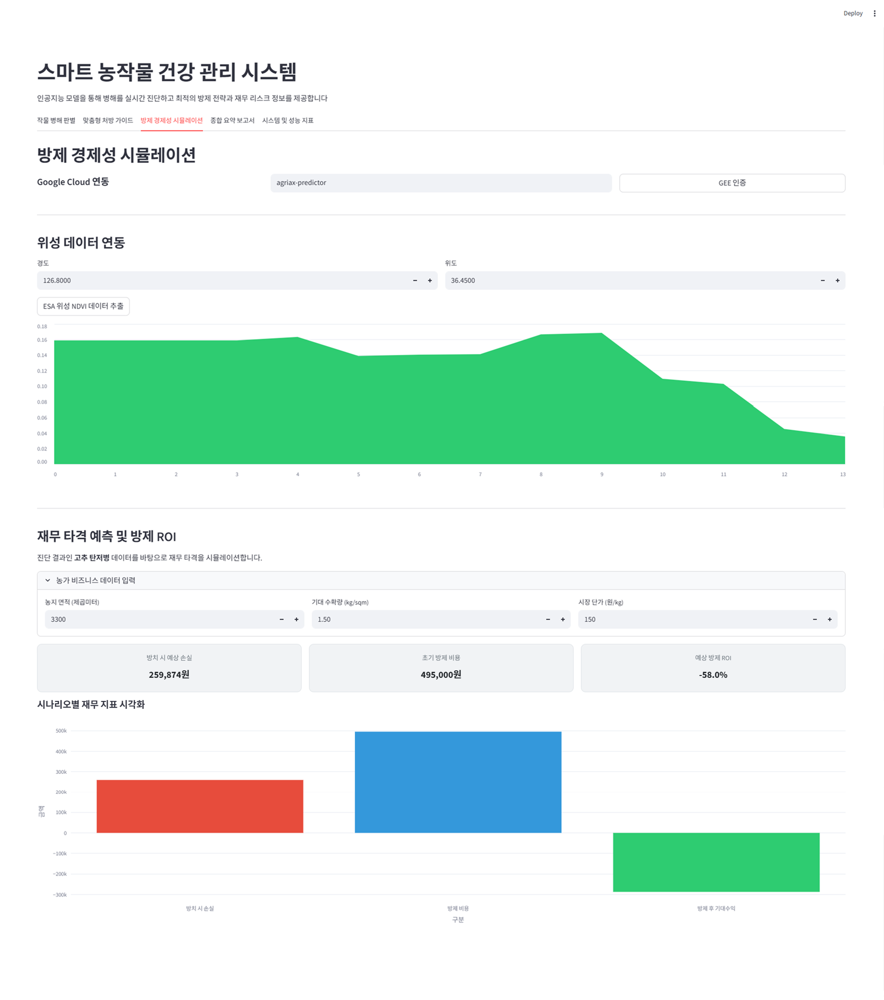

# AgriAX Predictor

> AgriAX Predictor는 인공지능 기반의 **스마트 농작물 건강 관리 및 방제 시뮬레이션 솔루션**입니다. **병해 판별·맞춤형 처방·재무 리스크 분석·종합 리포트** 4개 레이어가 통합되어 제공됩니다.


---

## 서비스 화면

| 작물 병해 판별 (Vision AI) | 방제 경제성 시뮬레이션 (ROI) |
|:---:|:---:|
|  |  |
| 업로드한 작물 이미지를 분석하여 질병을 진단하고, Grad-CAM을 통해 AI 판단 근거(히트맵)를 시각적으로 제공합니다. | 진단 결과를 바탕으로 농지 면적, 기대 수확량 등을 입력해 방치 시 예상 손실과 방제 비용 투자 대비 ROI를 시뮬레이션합니다. |

---

## 목차

1. [소개](#1-소개)
2. [주요 화면](#2-주요-화면)
3. [핵심 기능](#3-핵심-기능)
4. [기술 스택](#4-기술-스택)
5. [아키텍처 개요](#5-아키텍처-개요)
6. [설치 방법](#6-설치-방법)
7. [프로젝트 구조](#7-프로젝트-구조)
8. [모델 권장 및 인프라](#8-모델-권장-및-인프라)
9. [트러블슈팅](#9-트러블슈팅)
10. [향후 로드맵](#10-향후-로드맵)

---

## 1. 소개

기후 변화와 농업 환경 다변화로 인해 농작물 병해충 피해가 급증하고 있습니다. 데이터 기반의 정확한 병해 판별과 경제성을 고려한 방제 전략 수립이 필수적입니다.

AgriAX Predictor는 농가 및 농업 법인을 대상으로 실시간 이미지 기반 병해 진단, Google Earth Engine 기반 환경 데이터 연동, 그리고 지식 기반(RAG) 처방 및 방제 경제성 시뮬레이션을 제공하는 **올인원(All-in-One) 플랫폼**입니다.

### 설계 원칙

| 원칙 | 내용 |
|------|------|
| **사용자 친화적** | 직관적인 Streamlit 다중 탭 UI를 통해 누구나 쉽게 분석 가능 |
| **데이터 결합** | 위성 이미지(GEE)와 현장 질병 이미지 데이터를 결합한 입체적 분석 |
| **경제성 중심** | 단순 방제법 추천을 넘어 비용 대비 편익(ROI) 시뮬레이션 제공 |

**대상 사용자:** 스마트팜 운영자, 농업 기술 연구원, 농장 단위 관리자

---

## 2. 주요 화면

앱은 아래와 같은 다중 탭으로 구성되어 직관적인 워크플로우를 제공합니다.

1. **작물 병해 판별**: 현장에서 촬영한 작물 이미지를 업로드하여 딥러닝 모델이 실시간으로 병해 종류와 발병 확률을 진단합니다.
2. **맞춤형 처방 가이드 (RAG)**: 진단된 병해 정보와 현재 토양/기상 데이터를 바탕으로 LLM이 지식 베이스를 검색하여 최적의 방제 방법과 농약/비료 처방을 제공합니다.
   <br>
3. **방제 경제성 시뮬레이션**: 특정 방제 조치에 소요되는 비용과 수확량 보존에 따른 예상 수익을 시각적으로 비교해 재무적 의사결정을 돕습니다.
   <br>
4. **종합 요약 보고서**: 진단, 처방, 재무 분석까지의 결과를 하나의 리포트 형태로 요약하여 PDF 등 보고에 적합한 형태로 표시합니다.
   <br>
5. **시스템 및 성능 지표**: Vision Model 추론 속도, Earth Engine API 연결 상태, GPU 할당 여부 등 시스템 헬스체크 모니터링을 제공합니다.

---

## 3. 핵심 기능

| 기능명 | 설명 | 위치 |
|---------|------|-----------|
| **Vision Analyzer** | PyTorch 기반 농작물 이미지 병해 진단 엔진 | `src/vision_model.py` |
| **Earth Engine 연동** | 실시간 기상/토양 공간 데이터 수집 및 분석 | `src/earth_engine.py` |
| **RAG 기반 처방** | 병해충 지식 베이스 문서 검색을 통한 맞춤 가이드 | `app/tabs/tab2_rag.py` |
| **재무 시뮬레이션** | 방제 시나리오별 ROI, 손익분기점 등 경제성 시각화 | `app/tabs/tab3_finance.py` |
| **통합 리포팅** | 상태 요약 및 최종 진단서 작성 파이프라인 | `app/tabs/tab4_report.py` |

---

## 4. 기술 스택

**Frontend & App Framework**  


**AI & Machine Learning**  


**Data Processing & GIS**  


**Visualization**  


---

## 5. 아키텍처 개요

AgriAX Predictor는 프론트엔드와 백엔드가 결합된 모놀리식 구조이며, 전역 Session State를 통해 탭 간 데이터를 유기적으로 공유합니다.

```text
[ UI Layer: Streamlit ]  다중 탭 인터페이스 (병해 판별, 처방, 시뮬레이션 등)
           │
           ▼
[ State Management  ]    Session State (app/state.py) 를 통한 데이터 동기화
           │
           ▼
[ Core AI & Data Layer]
  ├── Vision Analyzer  : 로컬 딥러닝 모델 (GPU/CPU 호환 추론)
  ├── RAG System       : 내부 문서 기반 검색 및 응답 엔진
  └── GEE Manager      : 위성 데이터 동기화 및 공간 분석 (API 연동)
```

**요청 처리 흐름:**
사용자 이미지 업로드 ➔ Vision Analyzer 병해 진단 ➔ GEE Manager 환경 정보 결합 ➔ RAG 처방 도출 ➔ Finance 시뮬레이션 ➔ Report 생성

---

## 6. 설치 방법

### 1. 사전 준비
- Python 3.9+
- Google Earth Engine API 계정 및 인증 토큰
- (선택) CUDA 지원 GPU 및 관련 드라이버

### 2. 패키지 설치
가상환경을 생성하고 의존성 패키지를 설치합니다.

```cmd
python -m venv .venv

# Windows 환경
.venv\Scripts\activate

# Mac/Linux 환경
# source .venv/bin/activate

pip install -r requirements.txt
```

### 3. GEE(Google Earth Engine) 인증 설정
터미널에서 아래 명령을 실행하여 프로젝트에 대한 접근 권한을 부여합니다.
```cmd
earthengine authenticate
```

### 4. 서버 실행
Streamlit 앱을 실행합니다.

```cmd
streamlit run AgriAX.py
```
접속 주소: http://localhost:8501

---

## 7. 프로젝트 구조

```text
AgriAX_Predictor/
├─ AgriAX.py                     # Streamlit 앱 엔트리포인트 메인 파일
├─ app/                          # UI 렌더링 및 상태 관리
│  ├─ state.py                   # Session State 초기화 및 전역 변수
│  └─ tabs/                      # 탭별 화면 UI 및 로직
│     ├─ tab1_vision.py          # 병해 판별
│     ├─ tab2_rag.py             # 처방 가이드
│     ├─ tab3_finance.py         # 재무 시뮬레이션
│     ├─ tab4_report.py          # 종합 리포트
│     └─ tab5_tech.py            # 성능 지표
├─ src/                          # 비즈니스 로직 핵심 엔진
│  ├─ earth_engine.py            # GEE API 추상화 및 데이터 추출
│  └─ vision_model.py            # 딥러닝 이미지 추론 클래스
├─ data/                         # CSV, JSON 등 메타데이터 및 분석 자료
├─ docs/                         # 추가 아키텍처 문서 및 명세
├─ models/                       # 훈련된 신경망 모델 가중치 파일 (예: .pt)
├─ notebooks/                    # 개발 및 실험용 Jupyter Notebooks
├─ scripts/                      # 데이터 수집, 모델 학습용 배치 스크립트
└─ tools/                        # 개발 지원 유틸리티
```

---

## 8. 모델 권장 및 인프라

### Vision Model (병해 진단)
- **CPU 환경**: 경량화된 모델(MobileNetV3 등)을 사용하면 약 1~2초 이내의 빠른 추론이 가능합니다.
- **GPU 환경**: `VisionAnalyzer` 로딩 시 자동으로 CUDA 장치를 감지하여 PyTorch 텐서를 할당하므로 대용량 배치 처리나 고해상도 이미지 진단에 유리합니다.

### Earth Engine
- GEE API 특성상 외부 네트워크 의존성이 존재하므로, 네트워크가 차단된 폐쇄망(온프레미스)에서는 작동이 제한될 수 있습니다. 필요시 오프라인 위성 데이터(.tif) 로딩 로직으로 대체해야 합니다.

---

## 9. 트러블슈팅

### Streamlit 로딩 무한 지연 (Hanging)
초기 앱 실행 시 `VisionAnalyzer.load_model()` 부분에서 큰 모델 파일을 메모리에 적재하거나 GEE 인증 대기 중일 수 있습니다. 터미널의 에러 로그를 확인하고 모델 용량이 적절한지 점검하세요.

### `ee.ee_exception.EEException: User is not authorized`
Google Earth Engine API 인증 기한이 만료되었습니다. 터미널을 열고 `earthengine authenticate` 명령을 다시 수행하세요.

### PyTorch - TensorFlow 충돌 문제
requirements에 두 딥러닝 프레임워크가 동시에 존재할 수 있습니다(사용하는 툴킷에 따라 다름). GPU VRAM 부족이 발생하면 애플리케이션 시작 전 환경변수로 `CUDA_VISIBLE_DEVICES`를 제한하거나, 한 프레임워크가 메모리를 독점하지 않게 설정해야 합니다.

---

## 10. 향후 로드맵

### 단기 목표
- **다품종 지원**: 사과, 토마토, 고추 등 주요 작물별 전용 Vision 진단 모델 추가 도입.
- **UI 반응성 개선**: 대용량 이미지 처리 시 비동기 로딩 스피너 및 진척도 표시줄 세분화.

### 중장기 목표
- **IoT 센서 연동**: 스마트팜 내부의 온/습도, 토양 수분 센서 데이터(MQTT 등) 실시간 스트리밍 결합.
- **지역형 LLM 에이전트 구축**: RAG 시스템을 더욱 고도화하여 특정 지역의 기상청 정보나 로컬 농약 재고 현황을 즉시 가져와 답변에 반영.
- **예측형 방제 모델**: 발생 후 대응이 아닌, GEE 시계열 환경 데이터를 바탕으로 1주일 뒤의 병해충 발생 확률을 사전 예측하는 시계열 모듈 결합.
